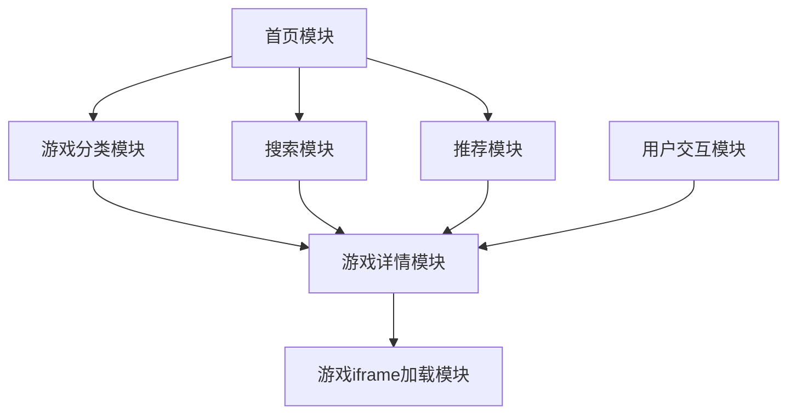

# 系统架构与设计模式

## 整体架构
HTML5游戏聚合平台采用前端为主的轻量级架构，以静态网站形式部署，通过CDN加速内容分发。架构设计注重简洁高效，方便后续扩展。

```
前端界面 → API接口/静态数据 → CDN分发 → 用户浏览器
```

## 核心模块关系


## 设计模式应用

### 前端设计模式
1. **组件化设计**
   - 将界面拆分为可复用的组件（导航栏、游戏卡片、分页器等）
   - 每个组件负责特定功能，便于维护和扩展

2. **数据驱动视图**
   - 使用JSON数据源驱动页面渲染
   - 前端通过JavaScript动态生成游戏列表和详情页

3. **响应式布局**
   - 基于Bootstrap栅格系统实现多设备适配
   - 针对移动端优化用户交互体验

### 数据管理模式
1. **静态数据文件**
   - 游戏元数据存储于JSON文件中
   - 结构化数据便于查询和过滤

2. **本地存储**
   - 利用localStorage存储用户偏好和游戏收藏信息
   - 减少服务器依赖，提升用户体验

## 关键实现技术

### 前端框架与工具
- **HTML5 + CSS3**：构建页面结构和样式
- **JavaScript/jQuery**：实现交互逻辑
- **Bootstrap**：响应式布局框架
- **CDN资源**：加速静态资源加载

### 性能优化策略
- **资源懒加载**：图片和非首屏内容采用懒加载技术
- **代码压缩**：部署前对HTML/CSS/JS进行压缩
- **缓存策略**：合理设置HTTP缓存头
- **按需加载**：分类页和游戏详情页内容按需加载

## 扩展性考虑
该架构设计为后续功能扩展预留了空间：

1. **后端服务集成**
   - 预留API接口设计，便于未来接入Node.js后端
   - 用户系统、评论功能等可通过API扩展

2. **数据分析集成**
   - 预留Google Analytics或自建数据统计接口
   - 可跟踪游戏点击率、访问深度等指标

3. **广告系统**
   - 设计中预留广告位位置
   - 支持第三方广告系统接入 